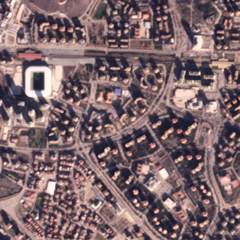
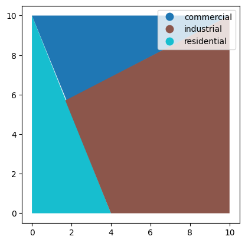

Usage
=====

Here's how you can use the `landusemix` package to calculate the entropy and HHI indices.

.. code-block:: python

    from landusemix import LandUseMixIndices  # Updated import statement

    # Example land use areas (in square meters)
    land_use_areas = {
        'residential': 5000,
        'commercial': 3000,
        'industrial': 2000,
    }

    # Create an instance of the LandUseMixIndices class
    mix_indices = LandUseMixIndices(land_use_areas)

    # Calculate the entropy index
    entropy = mix_indices.entropy_index()
    print(f"Entropy Index: {entropy}")

    # Calculate the Herfindahl-Hirschman Index (HHI)
    hhi = mix_indices.herfindahl_hirschman_index()
    print(f"Herfindahl-Hirschman Index: {hhi}")

.. code-block:: python

    # Output:
    # Entropy Index: 0.5986122886681098
    # Herfindahl-Hirschman Index: 0.3333333333333333

Display Raster
============================
If you want to display the input raster data, the following code snippet demonstrates how to display a raster image using the `rasterio` package.

.. code-block:: python

    import rasterio
    import matplotlib.pyplot as plt

    # Open the raster file
    with rasterio.open('raster.tiff') as src:
        # Read the raster image
        raster_image = src.read(1)

        # Display the raster image
        plt.imshow(raster_image, cmap='viridis')
        plt.colorbar()
        plt.show()

.. code-block:: python
    
        # Output:
        # Display the raster image in a matplotlib plot.

Display Shapefile
==================================
If you want to display the input raster data, the following code snippet demonstrates how to display a shapefile using the `geopandas` package.

.. code-block:: python

    import geopandas as gpd
    import matplotlib.pyplot as plt

    # Read the shapefile
    gdf = gpd.read_file('landusemix/data/shapefiles/multiple.shp')

    # Display the shapefile using matplotlib with different colors for each land use
    fig, ax = plt.subplots()
    gdf.plot(column='use', ax=ax, legend=True)
    plt.show()

Display Results
============================
Below is an example of how to visualize the calculated indices using the `matplotlib` package.

.. code-block:: python

    import matplotlib.pyplot as plt
    import geopandas as gpd

    # Assuming 'results' is a GeoDataFrame with calculated indices
    results.plot(column='Entropy_Index', legend=True, cmap='viridis')
    plt.title('Entropy Index Visualization')
    plt.show()

    results.plot(column='HHI', legend=True, cmap='plasma')
    plt.title('Herfindahl-Hirschman Index Visualization')
    plt.show()

